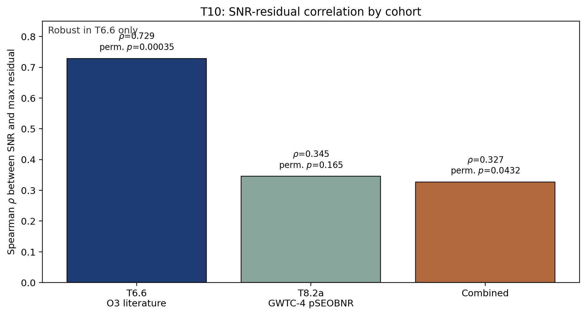

# ringest_fase_2

[](https://doi.org/10.5281/zenodo.19813389)
[](#reproducibility)

This is Phase 2 of the RINGEST series. Phase 1 dataset is required as input (Zenodo DOI `10.5281/zenodo.19813389`).

Phase 2 is a minimal reproducibility repository for the Kerr-audit material used in Paper 2. It turns verified Phase 2 CSV/JSON audit products into manuscript-ready tables, figures, and a paper skeleton.



## At a Glance

- Input base from Phase 1: `data/phase1_data/` and `data/phase1_outputs/`
- Real audit inputs read from: `../RINGEST/runs_sync/active/`
- Table builder: `scripts/make_tables.py`
- Figure builder: `scripts/make_figures.py`
- Paper skeleton: `paper/paper_gamma_2.tex`

Generated artifacts:

- `paper/tables/t9_population_tail_stats_table.tex`
- `paper/tables/t10_snr_residual_audit_table.tex`
- `paper/tables/t10_overlap_decomposition_table.tex`
- `paper/tables/source_audit_critical_events_table.tex`
- `paper/figures/t10_snr_residual_by_cohort.pdf`
- `paper/figures/t10_1_overlap_shapley.pdf`
- `paper/figures/source_audit_critical_events.pdf`

## Scope

This repository covers the reproducible audit layer for Paper 2:

- T9.2 population-tail NULL audit inputs and tables
- T10 SNR-residual cohort diagnostic
- T10.1 six-event paired Shapley decomposition
- source-audit comparison for the three critical events

It does not re-run the original exploratory pipelines under `RINGEST/runs_sync/active`; those are treated as fixed read-only inputs here.

## Reproducibility contents

This repository is the reproducibility package for RINGEST Paper 2.

Main components:

- `paper/paper_gamma_2.tex` - Paper 2 manuscript draft.
- `scripts/paper2/` - versioned analysis producers for the Paper 2 statistical checks.
- `runs_sync/verified/` - verified analysis outputs used by the manuscript.
- `runs_sync/verified/*/RERUN_PROVENANCE.md` - checksums and provenance for each verified run.

The downstream statistical analyses were performed from frozen input tables using version-controlled scripts. External catalog metadata were treated as frozen inputs before downstream analyses.

These artefacts support reproducibility of the tabulated analyses. They are not, by themselves, evidence for new physics.

## Paper 2 analysis scripts

The Paper 2 analysis producers are:

| Script | Purpose |
|---|---|
| `scripts/paper2/01_build_population_metadata.py` | Build the population metadata table from frozen/external catalog metadata inputs. |
| `scripts/paper2/02_build_population_tail_statistics.py` | Compute the T9 population-tail statistics. |
| `scripts/paper2/03_audit_snr_residuals.py` | Audit SNR dependence of Kerr residuals. |
| `scripts/paper2/04_patch_snr_residual_interpretation.py` | Apply documented interpretation text for the SNR residual summary. |
| `scripts/paper2/05_decompose_snr_overlap.py` | Decompose SNR-overlap residual changes into analysis groups. |
| `scripts/paper2/06_patch_overlap_interpretation.py` | Apply documented interpretation text for the overlap-decomposition summary. |

## Verified outputs

Verified outputs are stored under:

- `runs_sync/verified/kerr_population_tail_t9_verified_2026-04-27/`
- `runs_sync/verified/kerr_snr_systematics_t10_verified_2026-04-27/`

Each directory contains a `RERUN_PROVENANCE.md` file with checksums.

## Reproducibility

This repository assumes the real Kerr-audit inputs are available under:

`../RINGEST/runs_sync/active`

From the repository root:

```bash
python3 scripts/make_tables.py
python3 scripts/make_figures.py
```

Outputs are written to:

- `paper/tables/`
- `paper/figures/`

Full details are in [REPRODUCIBILITY.md](REPRODUCIBILITY.md).

## Repository Layout

```text
ringest_fase_2/
├── data/
├── paper/
│   ├── figures/
│   ├── tables/
│   ├── paper_gamma_2.tex
│   └── refs.bib
├── runs_sync/
│   └── verified/
├── scripts/
│   └── paper2/
├── README.md
└── REPRODUCIBILITY.md
```

## Phase 1 Dependency

Phase 1 remains the canonical literature-based dataset package:

- Repository: `https://github.com/nacho09021973/ringest_fase_1`
- Zenodo DOI: `10.5281/zenodo.19813389`
